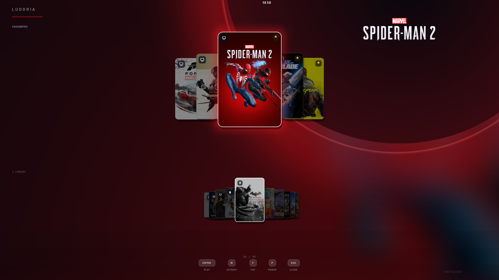
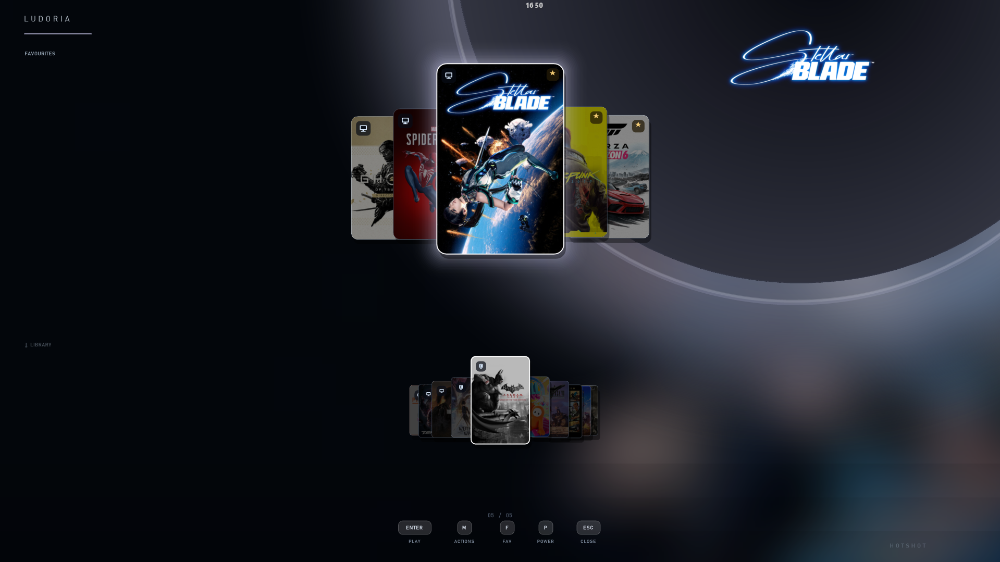

# Ludoria Nexus

**Your entire game library, summoned like a superpower.** Press one key and a
fullscreen carousel fades in over whatever you're doing - pick a game,
press Enter, and Ludoria melts away into the launch. No window to manage, no
app to "open", no waiting.

  
  

## Why not Playnite / LaunchBox / Steam Big Picture?

- **It's an overlay, not an app.** Everything else is a windowed program you
  alt-tab to. Ludoria summons and vanishes in-place - F7 or the controller
  Guide button, from anywhere, even mid-desktop.
- **Consumes 0 resources** You heard it right. Unlike other "Apps" in the market
  that run on Electron or other heavier tools, this is just an overlay on your
  windows which doesn't even cache images. It hardly takes 2MB of your RAM on idle! 
- **Zero configuration.** Steam, Epic and locally installed games are found
  automatically; official cover/hero/logo art is fetched for you. First run is
  a library, not a setup wizard.
- **Controller-first.** Full couch navigation - stick, D-pad, A/B/X/Y, Guide to
  summon - with keyboard and mouse equally at home.
- **It themes itself per game.** Accent colours are extracted from each game's
  artwork; the glass, the glow, the whole UI re-tints as you browse.
- **Absurdly light.** One AutoHotkey script + one CSV. No database, no account,
  no telemetry, no background bloat - the GPU surface exists only while the
  overlay is on screen.
- **Yours.** The library is a plain `games.csv` you can edit in Notepad. Art is
  a folder of PNGs. Portable folder, copy it anywhere.

## Quick start

1. Run Ludoria.bat and wait for 30s. Let it scan for your games and search for the relevant metadata.
2. Run `Ludoria.exe`. Check for the exe in your tray icons.
3. Press **F7** or the controller **Guide** button to launch.

## Controls

| Input | Action |
|---|---|
| Left/Right, wheel, stick, d-pad | Browse |
| Up / Down | Favourites / Library decks |
| Enter / Space / A / click | Launch |
| F / X | Favourite |
| H | Hide from wheel |
| M / Y | Action sheet (rescan, repair art, edit CSV) |
| P / Tab / View | Power tab (hold to confirm) |
| Esc / B | Back / close |

## Files

| Path | What it is |
|---|---|
| `data/games.csv` | Your library - edit directly or via the action sheet |
| `data/art/` | Drop in `Game Name_cover.png` / `_hero.png` / `_logo.png` |
| `sfx/` | UI sounds |

`data/` is created on first run and is intentionally not tracked here.
